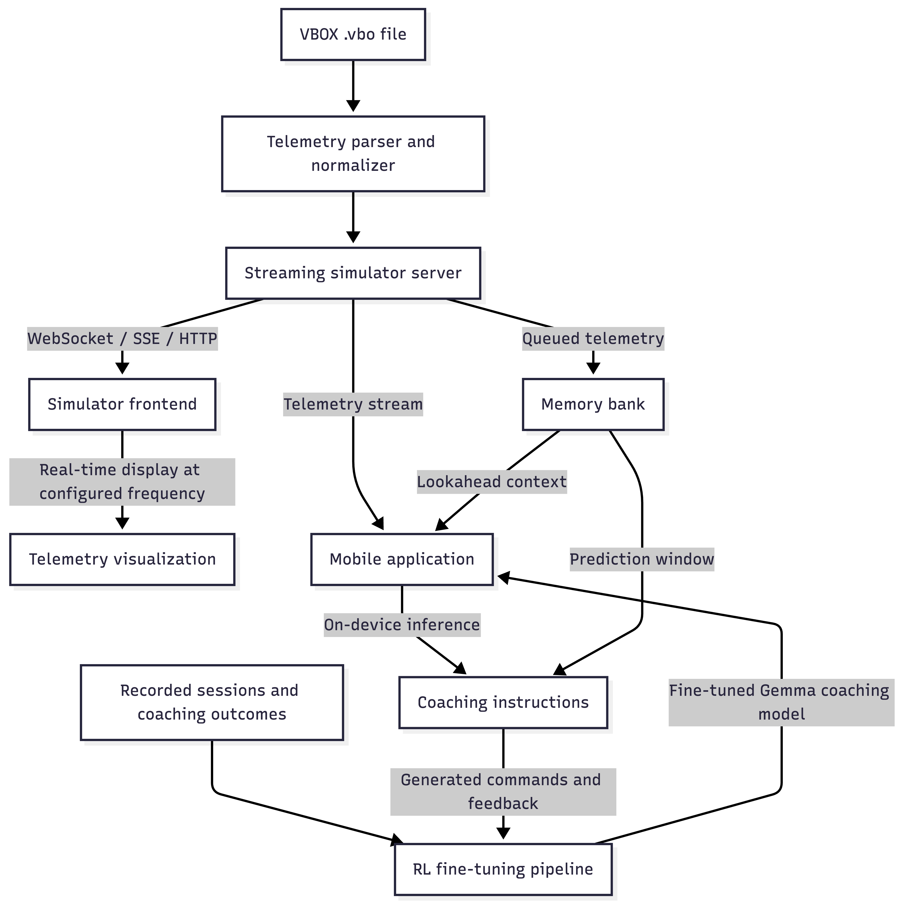

ApexAI telemetry replay server
==============================

ApexAI provides a small FastAPI server for replaying racing simulator telemetry from
Racelogic VBOX `.vbo` files. Start the server with a VBO file path, and it parses the
file into normalized telemetry packets, replays samples using the original timestamp
intervals, and streams packets to multiple frontend clients over WebSocket or
Server-Sent Events.

## Features

- Parses Racelogic VBOX `.vbo` files from a command-line path.
- Normalizes common telemetry fields such as time, GPS position, speed, heading,
  throttle, brake, steering, gear, and lap.
- Replays samples in timestamp order using original VBO timing or an optional
  fixed stream interval.
- Allows stream frequency changes so the phone pipeline can be evaluated at
  different telemetry cadences before matching the frequency used during real
  field sessions.
- Supports replay controls: start, pause, stop, reset, seek, speed changes, and
  stream interval changes.
- Streams telemetry to multiple clients over WebSocket and Server-Sent Events.
- Exposes health, state, and latest telemetry HTTP endpoints.
- Supports local frontend development with CORS enabled for common localhost
  origins.
- Runs through `uv` and `make start` using `.env` configuration.

## Roadmap

- [x] Develop the telemetry streaming simulator server for replaying VBOX data
  over HTTP, WebSocket, and SSE.
- [ ] Build a simulator frontend that visualizes telemetry in real time according
  to the configured streaming frequency.
- [ ] Build a mobile application that receives streamed telemetry data and runs
  on-device inference to generate coaching instructions. Sebastian already has
  related work started here.
- [ ] Develop an RL pipeline to fine-tune a Gemma model for racing coaching
  commands.
- [ ] Integrate a memory bank where telemetry data can be queued and used for
  lookahead prediction, so the coaching pipeline can anticipate upcoming driver
  needs. Vikram already has related work started here.

## Pipeline Diagram



## Install

This project assumes `uv` is used for dependency management and run scripts.
From the repository root, install or sync the package environment with:

```bash
uv sync
```

`uv run` will also create the environment and install dependencies on demand.
The package depends on:

- `fastapi`
- `uvicorn`
- `pydantic`
- `pandas`
- `sse-starlette`

## Run

The recommended path is to configure `.env` and start through `make`.

`.env`:

```env
VBO_FILE=/absolute/path/to/session.vbo
HOST=0.0.0.0
PORT=8000
REPLAY_SPEED=1.0
STREAM_INTERVAL=
LOOP=
AUTOSTART=--autostart
```

Start the server:

```bash
make start
```

`STREAM_INTERVAL=` means replay uses the original VBO timestamp intervals. Set
`STREAM_INTERVAL=5` to stream one packet every 5 seconds. `LOOP=` means the
replay stops at the end. Set `LOOP=--loop` to restart from the first sample
after the final sample.

Changing `STREAM_INTERVAL` is useful for evaluating the downstream phone
pipeline at different streaming frequencies before running against the cadence
expected during real field sessions.

You can override `.env` values from the command line:

```bash
make start VBO_FILE=./data/session.vbo PORT=9000 STREAM_INTERVAL=5 LOOP=--loop
```

The direct `uv` command is:

```bash
uv run apexai-server --vbo-file ./data/sample.vbo --autostart --replay-speed 1.0
```

Equivalent Python module command through `uv`:

```bash
uv run python -m apexai.server --vbo-file ./data/sample.vbo --autostart --replay-speed 1.0
```

All options:

```bash
uv run apexai-server \
  --vbo-file ./data/session.vbo \
  --host 0.0.0.0 \
  --port 8000 \
  --replay-speed 1.0 \
  --stream-interval 5 \
  --loop \
  --autostart
```

On startup the server prints the VBO path, sample count, available columns,
approximate duration, replay speed, stream interval, loop setting, and autostart
setting. Omit `--stream-interval` to replay using the original VBO timestamp
intervals. Set it to a number of seconds to stream at a fixed cadence, for
example `5` for every 5 seconds or `60` for every minute.

## Test The Server

In one terminal, start the server:

```bash
make start
```

In another terminal, verify health and state:

```bash
curl http://localhost:8000/health
curl http://localhost:8000/state
```

If `AUTOSTART` is empty in `.env`, start replay manually:

```bash
curl -X POST http://localhost:8000/replay/start
```

To test SSE streaming from another terminal:

```bash
curl -N http://localhost:8000/events/telemetry
```

You should see events like:

```text
event: telemetry
data: {"sequence":0,"timestamp":...}
```

## HTTP API

Health and state:

```bash
curl http://localhost:8000/health
curl http://localhost:8000/state
curl http://localhost:8000/telemetry/latest
```

Replay control:

```bash
curl -X POST http://localhost:8000/replay/start
curl -X POST http://localhost:8000/replay/pause
curl -X POST http://localhost:8000/replay/stop
curl -X POST http://localhost:8000/replay/reset
```

Change replay speed:

```bash
curl -X POST http://localhost:8000/replay/speed \
  -H "Content-Type: application/json" \
  -d '{"speed": 2.0}'
```

Change streaming interval:

```bash
curl -X POST http://localhost:8000/replay/stream-interval \
  -H "Content-Type: application/json" \
  -d '{"seconds": 5}'
```

Restore source timestamp intervals:

```bash
curl -X POST http://localhost:8000/replay/stream-interval \
  -H "Content-Type: application/json" \
  -d '{"seconds": null}'
```

Seek to a sample index:

```bash
curl -X POST http://localhost:8000/replay/seek \
  -H "Content-Type: application/json" \
  -d '{"index": 100}'
```

## WebSocket client

Connect to `ws://localhost:8000/ws/telemetry` while replay is playing.

```html
<script>
  const socket = new WebSocket("ws://localhost:8000/ws/telemetry");

  socket.onmessage = (event) => {
    const packet = JSON.parse(event.data);
    console.log("telemetry", packet);
  };

  socket.onopen = () => console.log("connected");
  socket.onclose = () => console.log("disconnected");
</script>
```

## Server-Sent Events client

Connect to `http://localhost:8000/events/telemetry` while replay is playing.

```html
<script>
  const events = new EventSource("http://localhost:8000/events/telemetry");

  events.addEventListener("telemetry", (event) => {
    const packet = JSON.parse(event.data);
    console.log("telemetry", packet);
  });
</script>
```

## Telemetry packets

Each streamed packet is normalized to this shape:

```json
{
  "sequence": 0,
  "timestamp": 0.0,
  "latitude": null,
  "longitude": null,
  "speed": null,
  "heading": null,
  "altitude": null,
  "satellites": null,
  "throttle": null,
  "brake": null,
  "steering": null,
  "gear": null,
  "lap": null,
  "raw": {}
}
```

Missing optional VBO fields are returned as `null`. The original parsed row is
preserved in `raw`.
