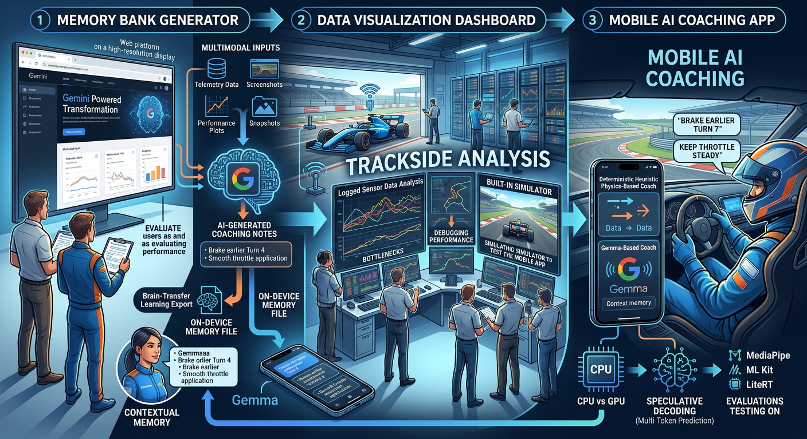
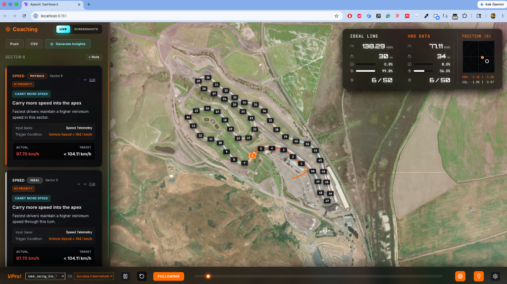
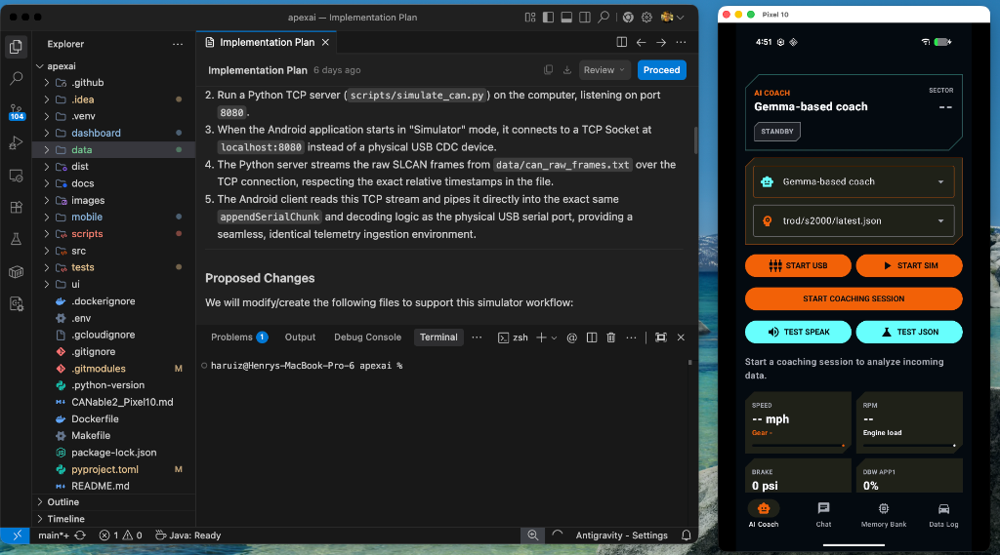

ApexAI 
=======

ApexAI is a real-time, on-device AI coaching system designed for professional and track-day drivers. It features a FastAPI telemetry server that ingests Racelogic VBOX `.vbo` files and raw CAN hex data, an Android application for live telemetry-driven on-device inference, and a Next.js web interface for post-session visualization. The system is designed to operate completely offline, enabling low-latency, trackside driver feedback without relying on external cloud dependencies.

## System Architecture

Following our AI Field Test at Sonoma Raceway—where we evaluated the system under real-world conditions and collected live telemetry data for our assigned driver—the ApexAI architecture was refined around three primary components:

### 1. Memory Bank Generator (located in the [dashboard/](dashboard) directory)

A web platform for coaches and drivers to evaluate, visualize, and debrief driving sessions. Powered by Gemini, the platform processes multimodal datasets—such as telemetry logs, trackside screenshots, data plots, and performance snapshots—to generate structured coaching notes.

These notes can be exported as a "brain-transfer" payload and loaded into the mobile application, providing the on-device Gemma model with contextual memory for real-time coaching.

### 2. Telemetry and Simulation Dashboard (located in the root folder)

A trackside analysis dashboard for visualizing logged sensor data extracted from the mobile device post-session. It is designed to identify performance bottlenecks and debug telemetry streams. Additionally, a built-in simulator enables developers to emulate track sessions, facilitating end-to-end testing of the mobile coaching application in a desktop environment.

### 3. Mobile AI Coaching App (located in the [mobile/](mobile) directory)

The core real-time interface of ApexAI, designed to deliver concise, timely, and actionable audio feedback to the driver while on track. The app deploys two complementary coaching engines:
- **Deterministic Coach**: Executes heuristic, physics-based rules to evaluate driver inputs.
- **Gemma-Based Coach**: Runs an optimized on-device Gemma model, utilizing exported session notes as contextual memory.

To minimize latency under racing conditions, the Gemma implementation was benchmarked across mobile CPUs and GPUs, leveraging speculative decoding (via Multi-Token Prediction) and evaluating multiple runtimes, including **MediaPipe**, **ML Kit**, and **LiteRT**.

---

## Technical Implementation Details

For each of the three core system components, we have implemented specific software modules:

### 1. Memory Bank Generator (located in [dashboard/](dashboard))
The **Memory Bank Generator** is built as a web-based data-analysis suite:
* **Frontend**: React + Vite frontend leveraging Leaflet for canvas-based, high-performance rendering of map lines, telemetry points, and friction circles.
* **Backend**: Node.js + Express API which serves maps tiles, manages run folders, and runs the analytics workflow.
* **Data Ingestion Engine**: A high-performance command-line utility written in **Rust** (`dashboard/data-engine/`) that parses raw `.vbo` telemetry logs at high speed.
* **AI Rule-Generation Pipeline**: A **Python** analytics backend (`dashboard/server/scripts/generate_coaching_rules_gemini.py`) that leverages **Gemini 3.5 Flash** to analyze statistical telemetry deltas and associate corner-specific screenshots of track segments. It generates optimized coaching JSON payloads containing exact target adjustments (e.g. throttle, brake pressures, and minimum corner speed thresholds).

### 2. Telemetry and Simulation Dashboard (located in root / [ui/](ui))
The trackside **Telemetry and Simulation Dashboard** consists of the telemetry simulation and ingestion layer:
* **FastAPI Telemetry Server**: Located in `src/apexai/server/`. Implements multiple streaming engines:
  * `VBOTelemetrySource` (in [telemetry_sources.py](src/apexai/server/telemetry_sources.py)): Replays VBOX `.vbo` logs line-by-line using original capture timestamps or throttled intervals.
  * `CanRawChunkTelemetrySource` (in [telemetry_sources.py](src/apexai/server/telemetry_sources.py)): Replays raw serial CANbus log files line-by-line as opaque hex chunks.
  * `CanDecodedTelemetrySource` (in [telemetry_sources.py](src/apexai/server/telemetry_sources.py)): Decodes CAN hex logs via `decode_can.py` to stream real vehicle parameters (RPM, Gear, Brake Pressure, Water Temp) as JSON payloads.
* **FastAPI Broadcaster**: Multiplexes and streams sensor packets to active listeners via WebSocket (`ws://localhost:8000/ws/telemetry`) and Server-Sent Events (SSE) (`/events/telemetry`) endpoints.
* **Next.js Web UI**: Located in `ui/`. Connects to the FastAPI server, maps the car's path in real time, and renders charts for active sensor channels. It includes seek, playback speed, and pause controllers via HTTP API calls.

### 3. Mobile AI Coaching App (located in [mobile/](mobile))
The **Mobile AI Coaching App** is a native Android application built in Kotlin:
* **Dual Coaching Engines**:
  * **Deterministic Mode**: Continuously evaluates driver speed and inputs against `.csv` limit tables using a local rules runner to trigger immediate alarms.
  * **AI Coach Mode**: Employs **Gemma 4:E2B** (via a locally-packaged `gemma-4-E2B-it.litertlm` runtime) to synthesize telemetry trends.
* **Optimized Edge Inference**:
  * **Gated Inference Engine**: Monitors real-time steering variance. Inference is blocked during high-lateral G corners to prevent thermal throttling on the device, triggering strictly upon corner exit (on straightaways).
  * **Native LiteRT LM Runtime**: Entirely replaces legacy Flutter/MediaPipe wrappers to execute raw offline LLM inference directly on the Pixel GPU/CPU.
  * **Latency Tracking**: Logs the duration of the telemetry-to-audio buffer path (within a strict 2-3s window suitable for high-speed driving).
  * **Audio Pipeline**: Leverages Android `TextToSpeech` to deliver natural audio instructions.

### 4. Tooling & Packaging
* **Environment Manager**: `uv` console scripts and `make` shortcuts run the server, launch the UI, and package the static UI into the Python package.

## Component Documentation & Setup

For detailed setup, installation, and execution instructions, please refer to the respective documentation for each component based on the folder structure:

* 🏎️ **Memory Bank Generator**: See [dashboard/README.md](dashboard/README.md) for web client, Express server, and Rust data-engine setup.
* 📊 **Telemetry and Simulation Dashboard**: See [instructions.md](instructions.md) for installing, configuring, running, and testing the telemetry and simulation server and web dashboard.
* 📱 **Mobile AI Coaching App**: See [mobile/README.md](mobile/README.md) for Android app installation, Gemma 4:E2B model setup, and deployment instructions.

## Roadmap

- [x] Develop the telemetry streaming simulator server for replaying VBOX data over HTTP, WebSocket, and SSE.
- [x] Add a CAN raw hex chunk source that can replay captured CANable serial chunks without decoding or changing the byte format.
- [x] Build a simulator frontend that visualizes telemetry in real time according to the configured streaming frequency.
- [x] Build a mobile application that receives streamed telemetry data and runs on-device inference to generate coaching instructions. Sebastian already has related work started here.
- [ ] Develop an RL pipeline to fine-tune a Gemma model for racing coaching commands.
- [x] Integrate a memory bank where telemetry data can be queued and used for lookahead prediction, so the coaching pipeline can anticipate upcoming driver needs. Vikram already has related work started here.
