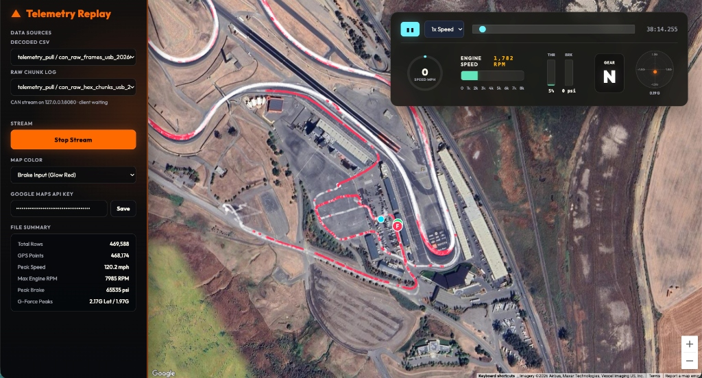

# Telemetry and Simulation Dashboard 🏎️



The **Telemetry and Simulation Dashboard** is the trackside analysis, telemetry streaming, and simulation component of the **ApexAI** system. It consists of a FastAPI server and a Next.js Web UI designed to replay and visualize high-frequency sensor streams (VBOX, raw CAN, and decoded telemetry data) in real time.

Additionally, the dashboard's built-in simulator allows developers and engineers to emulate track sessions, facilitating full end-to-end testing of the mobile coaching application in a local or network environment.

## Install

This project assumes `uv` is used for Python dependency management and run
scripts. From the repository root, install or sync the package environment with:

```bash
uv sync
```

`uv run` will also create the environment and install dependencies on demand.

The packaged UI is served by Python through `uv run apexai-ui`. Rebuilding the
static UI from source requires Node.js and npm because the source app is built
with Next.js.

## Quick Start

Start the telemetry and simulation server:

```bash
uv run apexai-server --input-file dashboard/data/raw/VBOX0148.vbo --autostart --replay-speed 1.0
```

Build the static UI once, then serve it in another terminal:

```bash
make ui-build
uv run apexai-ui
```

Open the UI at `http://127.0.0.1:3000` or `http://localhost:3000`. The server
endpoint field accepts either the API root, such as `http://localhost:8000`, or
the SSE URL, such as `http://localhost:8000/events/telemetry`.

## GitHub Pages Walkthrough

The `docs/` folder contains a static walkthrough app for GitHub Pages. In the
repository settings, set Pages to deploy with **GitHub Actions**. The
`.github/workflows/pages.yml` workflow uploads only `docs/`, so private or
unavailable submodules are not cloned during the Pages deployment.

For local preview:

```bash
cd docs
python3 -m http.server 4173
```

Then open `http://localhost:4173`.

## Telemetry and Simulation Server

For repeated local runs, configure `.env` and start through `make`.

`.env`:

```env
INPUT_FILE=/absolute/path/to/session.vbo
VBO_FILE=/absolute/path/to/session.vbo
HOST=0.0.0.0
PORT=8000
REPLAY_SPEED=1.0
STREAM_INTERVAL=
LOOP=
AUTOSTART=--autostart
```

Start the server:

```bash
make start
```

`INPUT_FILE` can point to a `.vbo`, `can_raw_hex_chunks*.txt`, or
`can_raw_frames*.txt` file. `VBO_FILE` is kept as a compatibility alias for old
VBOX-only setups. Use `DECODED=--decoded` with CAN frame files when you want the
server to run `src/apexai/scripts/decode_can.py`, write a `_decoded.csv`, and stream
readable values. `STREAM_INTERVAL=` means replay uses the original VBO
timestamps or CAN capture timestamps. Set `STREAM_INTERVAL=5` to stream one
packet every 5 seconds. `LOOP=` means the replay stops at the end. Set
`LOOP=--loop` to restart from the first sample after the final sample.

Changing `STREAM_INTERVAL` is useful for evaluating the downstream phone
pipeline at different streaming frequencies before running against the cadence
expected during real field sessions.

You can override `.env` values from the command line:

```bash
make start INPUT_FILE=dashboard/data/raw/VBOX0148.vbo PORT=8000 STREAM_INTERVAL=5 LOOP=--loop
```

The direct `uv` command is:

```bash
uv run apexai-server --input-file dashboard/data/raw/VBOX0148.vbo --autostart --replay-speed 1.0
```

Equivalent Python module command through `uv`:

```bash
uv run python -m apexai.server --input-file dashboard/data/raw/VBOX0148.vbo --autostart --replay-speed 1.0
```

All server options:

```bash
uv run apexai-server \
  --input-file dashboard/data/raw/VBOX0148.vbo \
  --host 0.0.0.0 \
  --port 8000 \
  --replay-speed 1.0 \
  --stream-interval 5 \
  --loop \
  --decoded \
  --autostart
```

On startup the server prints the selected input file, source kind, sample count,
available columns or payload labels, approximate duration, replay speed, stream
interval, loop setting, and autostart setting. Omit `--stream-interval` to
replay using the original VBO timestamps or CAN capture timestamps. Set it to a
number of seconds to stream at a fixed cadence, for example `5` for every 5
seconds or `60` for every minute.

## CAN Source

The server can also replay recorded CAN files through the same telemetry output
endpoints. CAN chunk files such as
`telemetry-data/CAN_files/can_raw_hex_chunks_usb_20260523_113848_600.txt` are
not decoded, split, or transformed. Each non-empty line is emitted as an opaque
CAN packet with the full source line and the exact raw hex chunk text preserved.

CAN frame files such as
`telemetry-data/CAN_files/can_raw_frames_usb_20260523_113848_600.txt` are
decoded before streaming. With `--decoded`, the server uses
`src/apexai/scripts/decode_can.py` to write a sibling `_decoded.csv`, then streams each
decoded row as readable telemetry values.

- WebSocket: `ws://localhost:8000/ws/telemetry`
- SSE: `http://localhost:8000/events/telemetry`

CAN raw chunk replay example:

```bash
uv run apexai-server \
  --input-file telemetry-data/CAN_files/can_raw_hex_chunks_usb_20260523_113848_600.txt \
  --stream-interval 0.01 \
  --autostart
```

CAN decoded frame replay example:

```bash
uv run apexai-server \
  --input-file telemetry-data/CAN_files/can_raw_frames_usb_20260523_113848_600.txt \
  --decoded \
  --stream-interval 0.01 \
  --autostart
```

CAN source controls:

- `/replay/start`, `/replay/pause`, `/replay/stop`, and `/replay/reset` control
  replay.
- `/replay/stream-interval` can throttle publishing, or use `{"seconds": null}`
  to follow the capture timestamps in the file.
- `/replay/speed` scales capture timestamp playback when no fixed stream
  interval is set.
- `/replay/seek` moves to a chunk or decoded frame index in the selected CAN file.

CAN raw packets use this shape:

```json
{
  "source": "can",
  "sequence": 0,
  "timestamp": 1779554347898.0,
  "line": "1779554347898,74 34 35 31 38 30 0D",
  "chunk": "74 34 35 31 38 30 0D"
}
```

Decoded CAN packets stream readable values as top-level fields:

```json
{
  "source": "can",
  "sequence": 1,
  "timestamp": 1779554348.072,
  "rpm": 0.0,
  "gear": 7,
  "speed": 0.0,
  "waterTempF": 194.0,
  "brakePressurePsi": null,
  "raw": {}
}
```

## Telemetry Source Implementation Guide

The server now has three source classes in
`src/apexai/server/telemetry_sources.py`:

- `VBOTelemetrySource`: replays parsed VBO rows. It supports start, pause, stop,
  reset, seek, replay speed, fixed frequency, source timestamp timing, and loop.
- `CanRawChunkTelemetrySource`: replays captured CAN raw hex chunk lines as
  opaque payloads. It supports start, pause, stop, reset, seek, replay speed,
  fixed frequency, capture timestamp timing, and loop.
- `CanDecodedTelemetrySource`: replays decoded CAN frame rows generated from
  `src/apexai/scripts/decode_can.py` and the sibling `_decoded.csv`.

Both classes publish packets to the same `Broadcaster`, so clients use the same
stream URLs regardless of the input protocol:

- `GET /events/telemetry` for SSE
- `GET /ws/telemetry` for WebSocket
- `GET /telemetry/latest` for the most recent packet
- `GET /telemetry/trace` for preloaded GPS trace points when the source has
  recorded GPS samples

### CLI arguments and hints

| Argument | Applies to | Description | Hint |
|---|---|---|---|
| `--input-file` | Both | Path to one `.vbo`, `can_raw_hex_chunks*.txt`, or `can_raw_frames*.txt` file. | Use this for selected-file VBOX or CAN replay. |
| `--vbo-file` | VBO | Compatibility alias for `--input-file`. | Existing VBOX scripts can keep using this. |
| `--data-dir` | VBO | Directory of `.vbo` files used when no input file is set. | Keeps the older batch VBOX replay mode working. |
| `--host` | Both | Host address for the FastAPI server. | `0.0.0.0` allows other devices on the network to connect. |
| `--port` | Both | TCP port for HTTP, SSE, and WebSocket. | Default is `8000`. |
| `--replay-speed` | Both | Multiplier for VBO or CAN capture timestamp playback. | `2.0` plays twice as fast when no fixed stream interval is set. |
| `--stream-interval` | Both | Fixed seconds between published packets. | `0.1` is about 10 Hz. Omit for source-driven timing. |
| `--loop` | Both | Restarts replay after the final sample or chunk. | Useful for long-running UI or Android tests. |
| `--decoded` | CAN frames | Decodes `can_raw_frames*.txt` to `_decoded.csv` before streaming. | Use this for readable CAN values such as RPM, gear, brake pressure, and GPS. |
| `--autostart` | Both | Starts the selected source when the server starts. | Without it, call `POST /replay/start`. |

### Control API behavior

| Endpoint | VBO behavior | CAN behavior |
|---|---|---|
| `POST /replay/start` | Starts or resumes file replay. | Starts or resumes raw chunk or decoded frame replay. |
| `POST /replay/pause` | Pauses at the current sample index. | Pauses at the current chunk or decoded frame index. |
| `POST /replay/stop` | Stops and resets to the first sample. | Stops and resets to the first chunk or decoded frame. |
| `POST /replay/reset` | Clears latest packet and resets index. | Clears latest packet and resets index. |
| `POST /replay/seek` | Moves to a VBO sample index. | Moves to a CAN chunk index. |
| `POST /replay/speed` | Changes VBO timestamp replay speed. | Changes CAN capture timestamp replay speed. |
| `POST /replay/stream-interval` | Sets fixed VBO output cadence or restores VBO timestamps. | Sets fixed CAN output cadence or restores capture timestamps. |

### Frequency examples

Set either VBO or CAN output to about 10 Hz:

```bash
curl -X POST http://localhost:8000/replay/stream-interval \
  -H "Content-Type: application/json" \
  -d '{"seconds": 0.1}'
```

Restore source-driven timing:

```bash
curl -X POST http://localhost:8000/replay/stream-interval \
  -H "Content-Type: application/json" \
  -d '{"seconds": null}'
```

For VBO, source-driven timing means the original VBO timestamps adjusted by
`--replay-speed`. For CAN, source-driven timing means the timestamp deltas from
the raw chunk capture file adjusted by `--replay-speed`.

## Dashboard Web UI

The repository contains a root-level Next.js app in `ui/`. It connects to the
FastAPI server, preloads the full GPS trace from `/telemetry/trace`, shows a
top-down race map, colors the route by a selected sensor, and displays compact
cards for the current sensor values. The UI is intentionally small: server
endpoint, sensor selector, colormap selector, map, and live readouts.

Build the static UI into the Python package:

```bash
make ui-build
```

Serve the packaged static UI without npm or Next.js:

```bash
uv run apexai-ui
```

Open the UI:

```text
http://127.0.0.1:3000
```

Optional static server arguments:

```bash
uv run apexai-ui --host 0.0.0.0 --port 3000
```

`make ui` wraps `uv run apexai-ui`. `make ui-dev` is kept as an alias for
`make ui`. If the telemetry and simulation server runs somewhere other than
`http://localhost:8000`, paste that server root or its `/events/telemetry` URL
into the UI's server endpoint field.

## CAN Map Dashboard

The legacy CAN/GPS map dashboard lives in
`src/apexai/scripts/map_server.py`. It scans user-provided data paths for
decoded CSV files and CAN raw chunk logs, then serves a browser dashboard and a
local CAN chunk replay socket.

```bash
uv run python src/apexai/scripts/map_server.py \
  --maps-api-key "YOUR_GOOGLE_MAPS_KEY" \
  --data-path telemetry-data/CAN_files \
  --data-path telemetry-data/VBOX_files \
  --host 0.0.0.0 \
  --port 8000 \
  --sim-host 127.0.0.1 \
  --sim-port 8080
```

`--data-path` can be passed multiple times. If omitted, the script scans the
current working directory. `--maps-api-key` pre-fills the Google Maps key in the
dashboard. `--sim-host` and `--sim-port` configure the CAN chunk replay socket;
for Android testing, reverse that port with `adb reverse tcp:8080 tcp:8080`.

## Packaged UI

`make ui-build` writes the static site into `src/apexai/ui/static`. When those
assets are present, `apexai-server` serves the UI from `/` while keeping the API
routes such as `/state`, `/replay/start`, and `/ws/telemetry` available.

## Test The Server

In one terminal, start the server:

```bash
make start
```

In another terminal, verify health and state:

```bash
curl http://localhost:8000/health
curl http://localhost:8000/state
```

If `AUTOSTART` is empty in `.env`, start replay manually:

```bash
curl -X POST http://localhost:8000/replay/start
```

To test SSE streaming from another terminal:

```bash
curl -N http://localhost:8000/events/telemetry
```

You should see events like:

```text
event: telemetry
data: {"sequence":0,"timestamp":...}
```

## Streaming Server Control HTTP API

Health and state:

```bash
curl http://localhost:8000/health
curl http://localhost:8000/state
curl http://localhost:8000/telemetry/latest
curl http://localhost:8000/telemetry/trace
```

Replay control:

```bash
curl -X POST http://localhost:8000/replay/start
curl -X POST http://localhost:8000/replay/pause
curl -X POST http://localhost:8000/replay/stop
curl -X POST http://localhost:8000/replay/reset
```

Change replay speed:

```bash
curl -X POST http://localhost:8000/replay/speed \
  -H "Content-Type: application/json" \
  -d '{"speed": 2.0}'
```

Change streaming interval:

```bash
curl -X POST http://localhost:8000/replay/stream-interval \
  -H "Content-Type: application/json" \
  -d '{"seconds": 5}'
```

Restore source timestamp intervals:

```bash
curl -X POST http://localhost:8000/replay/stream-interval \
  -H "Content-Type: application/json" \
  -d '{"seconds": null}'
```

Seek to a sample index:

```bash
curl -X POST http://localhost:8000/replay/seek \
  -H "Content-Type: application/json" \
  -d '{"index": 100}'
```

## Consume telemetry

## WebSocket client

Connect to `ws://localhost:8000/ws/telemetry` while replay is playing.

```html
<script>
  const socket = new WebSocket("ws://localhost:8000/ws/telemetry");

  socket.onmessage = (event) => {
    const packet = JSON.parse(event.data);
    console.log("telemetry", packet);
  };

  socket.onopen = () => console.log("connected");
  socket.onclose = () => console.log("disconnected");
</script>
```

## Server-Sent Events client

Connect to `http://localhost:8000/events/telemetry` while replay is playing.

```html
<script>
  const events = new EventSource("http://localhost:8000/events/telemetry");

  events.addEventListener("telemetry", (event) => {
    const packet = JSON.parse(event.data);
    console.log("telemetry", packet);
  });
</script>
```

## Telemetry packets

VBOX streamed packets are normalized to this shape:

```json
{
  "sequence": 0,
  "timestamp": 0.0,
  "latitude": null,
  "longitude": null,
  "speed": null,
  "heading": null,
  "altitude": null,
  "satellites": null,
  "throttle": null,
  "brake": null,
  "steering": null,
  "gear": null,
  "lap": null,
  "raw": {}
}
```

Missing optional VBO fields are returned as `null`. The original parsed row is
preserved in `raw`. CAN raw chunk packets use the opaque `source`, `sequence`,
`timestamp`, `line`, and `chunk` shape shown in the CAN Source section so the
mobile app can recognize and decode the raw hex format itself.
