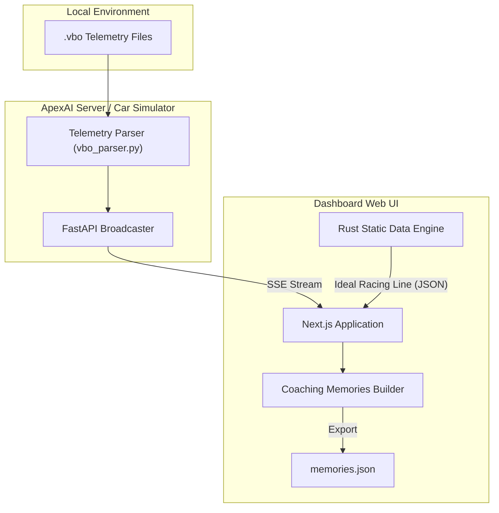
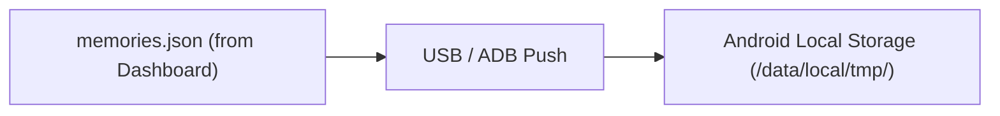
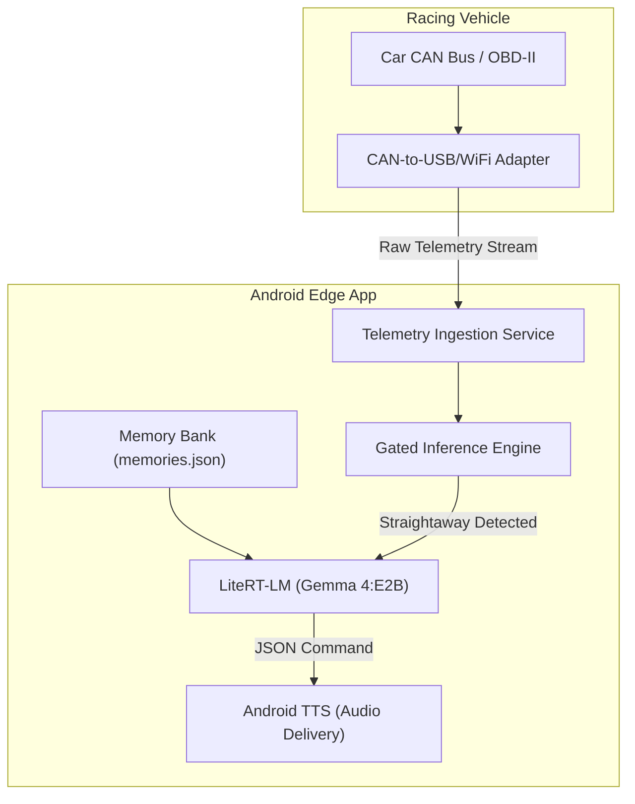

# Sonoma Racing Coach (ApexAI)

ApexAI is an end-to-end, real-time AI coaching application designed for professional track-day drivers. It ingests high-frequency racing telemetry, processes it against ideal theoretical racing lines, and leverages an on-device Edge LLM to deliver predictive, actionable audio feedback to the driver at 150+ mph.

The system is designed to run entirely offline at the edge (in-car) to avoid cloud connectivity latency and ensure safety and thermal reliability during aggressive track sessions.

---

## 🏗️ System Architecture

The ecosystem operates across three distinct architectural flows, separating offline pedagogical planning from real-time, in-car execution:

### 1. Offline Analysis & Memory Generation
Before heading to the track, the driving coach or engineer uses pre-recorded telemetry to build a strategic plan ("memories") for the driver.

### 2. Loading Memories to the Android App
The generated `memories.json` encapsulates the hyper-specific coaching heuristics (e.g., "brake 50m earlier at Turn 3"). Currently, this file is side-loaded onto the driver's Android device, securely bridging the offline analysis with the offline execution environment.

### 3. Realtime Coaching (Production Environment)
During the actual track session, the system operates **entirely offline** within the vehicle. Telemetry flows directly from the car's hardware to the Android device, utilizing the pre-loaded memories to generate predictive coaching audio.

---

## 🛠️ Technology Stack & Unique Innovations

The project synthesizes bleeding-edge technologies across Python, Rust, TypeScript, and Kotlin. Here are the core stacks and unique engineering solutions used:

### Backend (ApexAI Server)
- **Tech Stack:** Python 3.11, FastAPI, Uvicorn, `python-can`, `cantools`.
- **Unique Innovations:**
  - **Dual-Protocol Broadcasting:** Seamlessly transmits live telemetry across both **Server-Sent Events (SSE)** (for stateless web UIs) and **WebSockets** (for low-latency mobile edge apps) concurrently.
  - **Live CAN & Legacy VBOX Support:** Fuses live CAN bus ingestion (via `cantools` and DBC signal mapping) and legacy Racelogic `.vbo` text file replay into a single, unified `TelemetryPacket` schema.

### Data Engineering (Static Asset Engine)
- **Tech Stack:** Rust (`serde`, `serde_json`).
- **Unique Innovations:**
  - **Rust VBO-to-JSON Pipeline:** A custom `data-engine` written in Rust aggressively parses massive `.vbo` datasets into heavily optimized, lightweight JSON structures. This entirely eliminates dynamic backend loads when plotting the Ideal Racing Line, making the UI deployable as a high-speed static asset.

### Web Dashboard (Coaching UI)
- **Tech Stack:** TypeScript, React, Next.js.
- **Unique Innovations:**
  - **10Hz Spatial Matching:** Executes high-frequency mathematical distance calculations (Haversine formula) purely on the client-side to instantly detect where the car is relative to the pre-computed track sectors.
  - **Dynamic Environment Binding:** Intelligently switches telemetry source bindings based on `window.location.hostname`, seamlessly shifting from local `127.0.0.1` dev environments to deployed Google Cloud Run containers without `.env` management.

### Mobile Edge App (In-Car Coach)
- **Tech Stack:** Native Android Kotlin, Jetpack Compose, Google LiteRT-LM, OkHttp.
- **Unique Innovations:**
  - **Thermal-Aware Gated Inference:** The app mathematically monitors steering variance to detect cornering phases. It suppresses all LLM computation mid-corner, only unlocking the Gemma 4:E2B model on stable straightaways to prevent thermal CPU throttling in hot racing cabins.
  - **Strict JSON LLM Prompting:** The `Gemma4Manager` enforces hard metric generation instead of conversational chat, extracting distinct scalar values (e.g., "0.05 bar throttle") to construct authoritative Text-to-Speech instructions.

---

## 🏎️ Component 1: ApexAI Telemetry Simulation Server

**Role:** The foundational backend responsible for interpreting raw vehicle data and streaming it to downstream clients via high-throughput HTTP streams.

### Key Features & Implementation
- **Framework:** Python, FastAPI, and `uvicorn`.
- **Sources:** Supports both recorded Racelogic VBOX `.vbo` files and live CAN ingestion (via `python-can` and DBC decoding).
- **Streaming Protocols:** Telemetry is broadcast simultaneously via **Server-Sent Events (SSE)** (for the Dashboard) and **WebSockets** (for the mobile app).
- **Hardened Configuration:** The server auto-discovers all `.vbo` files inside the `./data/` directory and streams them continuously.

### Core Algorithms
- **Coordinate Normalization (Pure Minutes):** Raw VBO datasets often export GPS coordinates purely in minutes rather than standard degrees. The server's `vbo_parser.py` implements a translation algorithm:
  - `Decimal Degrees = abs(Minutes) / 60.0`
  - *Sign Correction:* VBOX standard uses positive numbers for Western longitudes. The parser inverts the longitude sign to conform to standard GPS (WGS84) conventions, accurately placing the telemetry at Sonoma Raceway.
- **Time Interpolation:** Replays recorded data at true-to-life cadence or fixed streaming intervals (e.g., 10Hz) to replicate live hardware environments.

---

## 📊 Component 2: Coaching Dashboard

**Role:** A visualization and pedagogical tool used to review sessions, benchmark performance against the Ideal Racing Line, and build contextual "memories" for the LLM.

### Key Features & Implementation
- **Framework:** React and Next.js, with static site generation for deployment portability.
- **Dynamic Endpoint Routing:** A unified frontend implementation dynamically routes SSE connections between a local development server (`127.0.0.1`) and the production Google Cloud Run endpoint based on `window.location.hostname`.
- **Pre-computed Asset Bundling:** To overcome Firebase Hosting constraints with large datasets, raw `.vbo` files are pre-processed into lightweight `.json` files via a high-performance **Rust-based Data Engine**, avoiding dynamic API calls and accelerating map rendering.

### Core Algorithms
- **Real-time Spatial Matching (Haversine Formula):** The dashboard computes the shortest spherical distance between the live streaming vehicle coordinates and the pre-computed static Ideal Racing Line to map the car to the correct track segment.
- **Telemetry Delta Calculation:** Extracts live velocity, throttle, brake, and gear from the stream and compares it instantly against the ideal line's telemetry vectors, surfacing micro-errors (e.g., "Braking 50m too early").

---

## 📱 Component 3: Mobile Edge Coaching App

**Role:** An Android application strapped inside the vehicle that serves as the AI racing coach. It operates completely disconnected from the cloud, utilizing on-device ML to ensure absolute privacy, zero latency variation, and robust thermal performance.

### Key Features & Implementation
- **Framework:** Native Android Kotlin with Jetpack Compose.
- **On-Device Inference:** Uses **Google's LiteRT-LM** to host a quantized **Gemma 4:E2B** model locally.
- **Pedagogical Delivery:** Instructions are formatted via strict JSON generation enforcing exact metric outputs (e.g., "Apply 0.05 bar throttle") rather than generic advice.

### Core Algorithms
- **Gated Inference Engine:** Operating an LLM at 10Hz inside a hot racing cabin risks severe thermal throttling. The application implements steering variance monitoring:
  - The Gemma LLM is *strictly prevented* from executing mid-corner.
  - Compute cycles are only triggered during stable straightaway segments.
- **Predictive Audio Queuing:** Mid-corner audio cues are a severe safety hazard. By running inference upon corner exit, Text-to-Speech instructions are queued and delivered 2-3 seconds prior to the *next* corner entry.
- **Latency Tracker:** A dedicated logging module that tracks the exact delta between receiving the WebSocket packet to the release of the audio buffer, ensuring the pipeline remains within the strict 2-3 second latency budget required for a 150+ mph field test.

---

## 🚀 Deployment & DevOps

The ecosystem is engineered for seamless cloud deployment to complement the offline edge applications.

- **Containerization:** The `apexai` backend is packaged inside a Docker image that leverages `uv sync --frozen` for deterministic, lightweight dependency resolution.
- **Cloud Run Orchestration:** Both the backend simulation server and the static Next.js dashboard are deployed via `Makefile` recipes directly to **Google Cloud Run**, automatically injecting cloud-assigned `PORT` configurations for seamless routing.
- **Unified Repository:** While organized into `ui/`, `mobile/`, and server modules, the repository relies on root-level `.gitignore` rules and strict separation of concerns, maintaining a clean CI/CD pipeline.

## 🚀 Future Improvements

- **Cloud Memory Synchronization:** Currently, the `memories.json` files are side-loaded directly to the Android device via ADB. A key future improvement is to synchronize these coaching heuristics over **Firebase**. The Dashboard will push generated memories directly to a Firebase bucket, and the Android App will pull these updates dynamically upon startup, entirely eliminating the need for wired ADB side-loading before track sessions.
